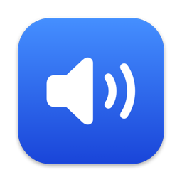

<div align="center">



# FreeAudio

**macOS のメニューバーでオーディオを操作 —— アプリごとに音量・出力デバイス・イコライザを設定でき、オーディオドライバのインストールは不要です。**

[](https://github.com/ExpTechTW/FreeAudio/releases/latest)
[](https://github.com/ExpTechTW/FreeAudio/releases)
[](https://github.com/ExpTechTW/FreeAudio/actions/workflows/release.yml)
[](#ダウンロード)
[](https://discord.gg/5dbHqV8ees)

[繁體中文](README.md) • [English](README.en.md) • **日本語**

[ダウンロード](https://github.com/ExpTechTW/FreeAudio/releases/latest) • [更新履歴](https://github.com/ExpTechTW/FreeAudio/releases) • [問題を報告](https://github.com/ExpTechTW/FreeAudio/issues)

</div>

## FreeAudio とは

FreeAudio は、メニューバーに常駐する macOS のオーディオツールです。デバイスの切り替えや音量調整に加えて、アプリごとに音量・出力デバイス・イコライザを設定したり、音を複数のデバイスから同時に再生したりできます。

macOS に組み込まれた Core Audio のプロセスタップで音を処理するので、仮想オーディオドライバをインストールする必要はありません。FreeAudio を通るのは設定を変えたアプリだけで、それ以外の音はこれまでどおりハードウェアへ直接届きます。

## できること

| | |
|---|---|
| **入力と出力** | スピーカーとマイクの切り替え、音量とミュートの調整。HDMI ディスプレイのように本体に音量調整がないデバイスも、FreeAudio で調整できます |
| **アプリ別音量** | アプリごとに 0〜200% の音量、ミュート、左右のバランス、10 バンドのイコライザを設定でき、出力デバイスの指定や複数デバイスへの同時出力もできます。アプリ専用の出力デバイスは別に表示されて音量を調整でき、ミュートされているとお知らせします。メニューバーに表示したくないアプリは非表示にして、設定で調整できます。ブラウザや Electron アプリの補助プロセスは、そのアプリにまとめられます |
| **全体マルチ出力** | すべての音を複数のデバイスから同時に再生します。AirPlay スピーカーを選ぶように「出力」でデバイスにチェックを付け、デバイスごとに音量・ミュート・バランス・イコライザを設定できます。アプリ単位で除外もできます |
| **イコライザ** | ミュージック App と同じ仕様です：10 バンド（32 Hz〜16 kHz）、±12 dB、プリアンプ、そして名前と値が同じ 22 個のプリセット |
| **ヘッドフォン補正** | [AutoEq](https://github.com/jaakkopasanen/AutoEq) がヘッドフォンの機種ごとに公開している `ParametricEQ.txt` を読み込み、音のバランスを補正します |
| **音声処理** | アプリと出力デバイスごとに、モノラルや左右の入れ替えに切り替えたり、大きな音を抑えて小さなせりふを持ち上げるナイトモードをオンにしたりできます。出力デバイスは再生を遅らせて、Bluetooth スピーカーなど遅いデバイスとそろえることもできます |
| **統計** | デバイスとアプリごとの使用時間、音量、ミュート、アプリが使ったデバイスを 1 分単位で記録し、時間ごとの分布や 1 日のタイムラインで確認したり、CSV に書き出したりできます。データはこの Mac にだけ 365 日間保存され、1 年で約 15 MB（使用が多い場合は約 50 MB）です |
| **聴覚** | 耳に届く音量を推定し、今日の平均・ピーク・安全な聴取量、過去 7 日間の記録、日ごとの音量の推移を表示します。大きな音が続くとお知らせし、毎週まとめを表示します |
| **選択したデバイスを固定** | FreeAudio で選んだスピーカーとマイクだけを使います。ヘッドフォンの接続時に macOS が自動で切り替えても、コントロールセンターで切り替えても元に戻します。選んだデバイスが見つからないときは、macOS が代わりに選んだデバイスをミュートしてお知らせし、別のデバイスには切り替えません |
| **新しいデバイスは無音から** | 初めて接続したスピーカーやマイクは 0% でミュートされるので、音が思わず鳴ったり拾われたりしません |
| **マイクのミュートは勝手に解除されない** | FreeAudio でミュートしたマイクは、FreeAudio で解除したときだけオンになります。Siri の聞き取りや通話中のデバイス切り替えで macOS が勝手に解除しても、すぐにミュートし直します。マイクがミュート中または使えないときは、メニューバーのアイコンが赤い斜線付きのマイクになります |
| **サウンド設定を記憶** | デバイス、音量、ミュートを記憶し、再起動後に自動で復元します |
| **自動アップデート** | Apple の公証を受けたアップデートを GitHub から取得し、同じ開発者が署名したものだけをインストールします。テスト版を受け取ることもできます |
| **3 つの言語** | 繁體中文・English・日本語。通常はシステムに合わせ、設定で切り替えることもできます |

## ダウンロード

**macOS 26 以降**が必要です。Apple シリコンと Intel のどちらでも使えます。

1. [Releases](https://github.com/ExpTechTW/FreeAudio/releases/latest) から `FreeAudio-<バージョン>.zip` をダウンロードして展開し、FreeAudio.app を「アプリケーション」フォルダに移動してから開きます。Apple の公証を受けているので、そのまま開けます。
2. 初めてアプリの音を調整するときに、macOS が「システムオーディオ録音」へのアクセスを求めるので「許可」を選びます。メニューバーのパネルや設定ウインドウの「アクセスを許可…」からも許可できます。
   - ダイアログが表示されない場合：「システム設定 › プライバシーとセキュリティ › 画面収録とシステムオーディオ録音」を開き、「システムオーディオ録音のみ」の一覧の下にある「＋」で FreeAudio を追加します。
   - 以前「許可しない」を選んだ場合：同じ一覧で FreeAudio をオンにします。
3. 再起動後にサウンド設定を自動で復元するには、設定で「ログイン時に起動」をオンにします。

FreeAudio は起動時とその後 6 時間ごとにアップデートを確認し、新しいバージョンがあればお知らせします。「設定 › アップデート」の「今すぐ確認」ですぐに確認することもできます。メニューバーのアイコンが隠れているときは、Finder や Spotlight から FreeAudio をもう一度開くと設定ウインドウが表示されます。

### 正式版とテスト版

| | 名前 | 公開のタイミング |
|---|---|---|
| 正式版 | `26.1`：年と番号 | 手動で公開 |
| テスト版 | `26w39a`：年、週、その週の何番目か | `main` へのプッシュごとに自動で公開。確認されていないため、問題がある場合があります |

新しいビルドをいち早く試すには、「設定 › アップデート」で「テスト版を受け取る」をオンにします。正式版は正式版にだけ、テスト版はテスト版にだけアップデートされます。メニューバーのパネルの下部には使用中のバージョンが表示され、テスト版はオレンジ、正式版は緑のラベルが付きます。

## 既知の制限

- 同じ種類のオーディオツール（BetterAudio、SoundSource、FineTune など）とは同時に使えません。音が二重に処理されてしまうためで、FreeAudio が検出するとパネルでお知らせします。
- ブラウザはすべてのタブの音を 1 つのプロセスで再生するため、ブラウザ全体でまとめて調整します。
- FreeAudio を通った音には、ごくわずかな遅延が加わります。
- Siri の音声処理はマイクのミュートを無視することがあります。Siri に聞かれないようにするには、システム設定で Siri の聞き取りをオフにしてください。
- 「聴覚」の音量は一般的な機器を基準にした推定で、測定値ではありません。お使いのヘッドフォンやスピーカーがそれより大きい・小さい場合は、「設定 › 聴覚」でデバイスごとに補正できます。

## 開発

ビルドには macOS 26 以降と Xcode 26 以降が必要です。

```bash
git clone https://github.com/ExpTechTW/FreeAudio.git
cd FreeAudio
git config core.hooksPath .githooks   # コミット時にコミットメッセージを確認
swift test                            # テストを実行
scripts/build-app.sh                  # build/FreeAudio.app をビルド
open build/FreeAudio.app
```

- `scripts/build-app.sh` はキーチェーンの証明書で署名します。Developer ID Application を優先し、なければ Apple Development を使います。どちらもない場合はアドホック署名になり、ビルドのたびに macOS が許可を求め、アップデートもできません。
- `swift run` でも実行できますが、許可がターミナルに付与されるため、ビルドしたアプリを使うことをおすすめします。
- コミットメッセージがそのまま更新履歴になります。書式は [commit.md](commit.md)（繁体字中国語）にあり、git フックと CI で確認されます。

### 仕組み

FreeAudio が処理するのは、設定を変えたアプリとデバイスだけです。「ルート」はそれぞれ、プロセスタップとプライベートなアグリゲートデバイスの組み合わせです。タップがアプリの音を取り込んで元の出力をミュートし、FreeAudio が IO コールバックで音量・バランス・イコライザ・リミッターを適用してから、出力先のデバイスで再生します。

- システムの出力に従うアプリは、そのデバイスへ向かう音だけを取り込みます。出力デバイスを指定したアプリは、すべての音を取り込みます。
- 出力デバイスのイコライザと全体マルチ出力は、FreeAudio 自身とほかのオーディオツールを除いたタップを使うので、フィードバックは起きません。
- ルートは音があるときだけ動き、アプリの再生が止まって 15 秒たつと待機に戻るので、出力デバイスがスリープできます。
- 出力デバイス自体がアグリゲートデバイス（「複数出力装置」など）の場合は、その構成デバイスでルートを組みます。
- 聴覚のモニタリング中は、ミュートも出力もしないタップがもう 1 つ、デフォルトの出力デバイスで再生される音を測ります（1 秒ごとの A 特性の音量）。そこにデバイスの音量と機器の種類ごとの基準値を足して、耳に届く音量を推定します。

| ファイル | 内容 |
|---|---|
| `AudioController.swift` | デバイスとプロセスを監視し、必要なルートを決める |
| `RoutePlan.swift`、`MultiOutput.swift` | 設定からルートを求める；全体マルチ出力のチェックのルール |
| `AudioRoute.swift`、`DSP.swift` | タップとアグリゲートデバイス；リアルタイム処理（イコライザ、ナイトモード、ゲイン、リミッター、遅延、チャンネルの割り当て、音量の測定） |
| `Correction.swift` | ヘッドフォン補正のプロファイルの読み込み |
| `Devices.swift`、`DeviceLock.swift`、`MicrophoneHold.swift` | デバイス、音量、ミュート；選択したデバイスの固定；マイクのミュートの維持 |
| `Processes.swift`、`Permission.swift` | プロセスのアプリへのまとめ；システムオーディオ録音の許可 |
| `Settings.swift` | 設定、イコライザのプリセットと保存 |
| `Usage.swift`、`Hearing.swift`、`History.swift` | 統計と聴覚の記録と計算；1 分単位で SQLite に保存 |
| `TrayView.swift`、`AppEditor.swift`、`SettingsWindow.swift`、`SettingsView.swift`、`StatisticsView.swift`、`HearingView.swift`、`HUD.swift`、`Components.swift` | メニューバーのパネル、設定ウインドウとその各ページ、通知、共通のコントロール |
| `Update.swift`、`Updater.swift` | 自動アップデート：バージョンの比較、ダウンロード、検証、置き換え |
| `Localization.swift` | 表示言語 |

### イコライザの出典

- バンドと範囲：ミュージック App の AppleScript 用語説明（`Music.app/Contents/Resources/com.apple.Music.sdef`）にある 10 バンド（32 Hz〜16 kHz）で、各バンドとプリアンプはどれも −12〜+12 dB です。
- プリセット：22 個の値はすべて `~/Library/Preferences/com.apple.Music.eq.plist`（`eqps:129:EQPresets`、単位 0.01 dB）からそのまま写しています。名前はミュージック App のローカライズ文字列を使い、新しいバージョンで名前が変わった 5 つも含みます。
- フィルタ：ミュージック App はフィルタの形を公開していないため、FreeAudio はバンドごとに 1 オクターブ幅のピーキングフィルタ（Audio EQ Cookbook）を使います。

### 公開

ルールは DPIP と同じです。`main` へのプッシュごとにテスト版が、`v<yy>.<n>` タグ（例：`v26.1`）で正式版が公開されます。どのビルドも Developer ID で署名して Apple の公証を受け、更新履歴はコミットの項目行から自動で作られ（[commit.md](commit.md) を参照）、Discord に投稿されます。

## ライセンス

[FreeAudio Public License](LICENSE)。**これはソースアベイラブルのライセンスで、オープンソースのライセンスではありません** —— ソースコードは公開されていて読むことも貢献することもできますが、商用利用は禁止されており、FreeAudio と競合する製品を作ることも禁止されています。全文は [LICENSE](LICENSE) をご覧ください。
